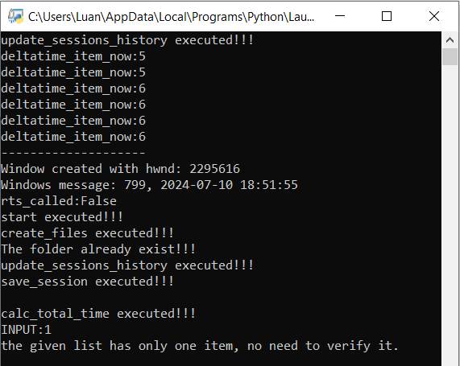
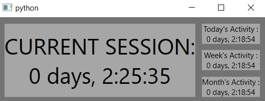

## How to set it up

### Fast Startup must be unable
#### It allows the boot time actually be resisted once you shut down
``python setup_files\disable_fast_startup.py ``

### Allow script to be executed at shutdown
#### Configure Shutdown options to allow top-level apps to hold shutdown event
``python config_execute_at_shutdown_perm.py``

## python required packages:
PyQt6 (GUI lib)  
``pip install pyqt6==6.7.0``  
psutil (only used for once, so the execute at shutdown script can work.)  
``pip install psutil==5.9.8``  
pywin32 (For the time spent estimation ) 
``pip install pywin32==306``

after installing everything restart your Machine

## Getting started
Once you log on you must see a terminal screen, that's the script that will keep track of your time once you shut down your pc. 
__
 
By running ``python app_gui.py`` you'll see your time spent.  

 

